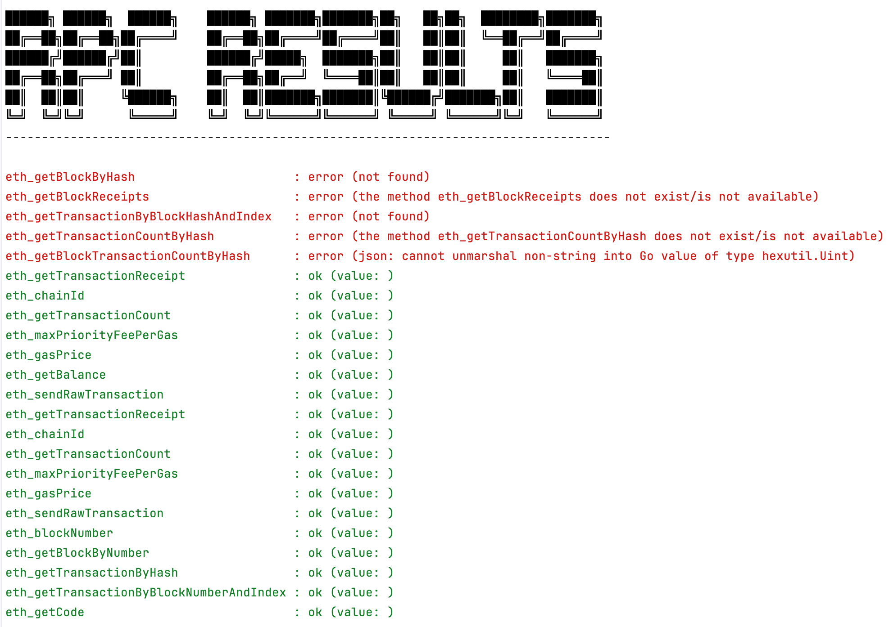

# ethrpc-checker



## Features
- Comprehensive Coverage: Verifies the implementation and functionality of Ethereum JSON-RPC API endpoints.
- Automated Testing: Automatically sends transactions and queries to ensure accurate and complete API responses.
- Detailed Reporting: Generates clear and structured reports highlighting any discrepancies or issues in the API implementation. 

## How to Run
```bash
# build the project
$ go build
# run the project 
$ ./ethrpc-checker -v -xlsx
```
- `-v` flag is for verbose mode. It will print the return value on the console.
- `-xlsx` flag is for generating the xlsx report. If you don't want to generate the xlsx report, you can remove this flag.

## Setup 
### Config
- Update config.yaml based on your environment.
```yaml
rpc_endpoint: "http://localhost:8545"
# rich_privkey: private key of the account that has enough balance to send transactions
rich_privkey: "b9d15599650f41dc705d1edf676830117d14bf41f7a06dac5d13228507cff77f"
# timeout is a hard dead line for the transaction to be mined. 
# if tx is not mined within this time, it will be considered as failed
timeout: "10s"
```

### ERC20 Token Contract
- Erc20 contract source code and binary are already existed in the repo. so you don't have to compile it manually.
- But, if you want to use your own contract, you can use the following commands:

```bash
$ brew update
$ brew upgrade
$ brew tap ethereum/ethereum
$ brew install solidity
$ cd /path/to/ethrpc-checker
$ solc --bin --abi --evm-version london ERC20.sol -o .     
```

- When compile finished, change the slot index of the GetStorageAt if you have different storage variables.